```mermaid
graph LR
    P0["0 clarify<br/><sub>clarifier</sub>"]
    P1["1 discover<br/><sub>researcher</sub>"]
    P2["2 specify<br/><sub>specifier</sub>"]
    P3["3 spec-challenge<br/><sub>reviewer | APPROVAL GATE</sub>"]
    P4["4 author<br/><sub>content-author</sub>"]
    P5["5 design<br/><sub>designer</sub>"]
    P6["6 design-review<br/><sub>reviewer | APPROVAL GATE</sub>"]
    P7["7 plan<br/><sub>planner</sub>"]
    P8["8 plan-review<br/><sub>reviewer | APPROVAL GATE</sub>"]
    P9["9 execute<br/><sub>executor</sub>"]
    P10["10 verify<br/><sub>verifier</sub>"]
    P11["11 review<br/><sub>reviewer</sub>"]
    P12["12 learn<br/><sub>learner</sub>"]
    P13["13 prepare-next<br/><sub>learner</sub>"]

    P0 --> P1 --> P2 --> P3
    P3 -- approved --> P4 --> P5 --> P6
    P3 -. rejected .-> P2
    P6 -- approved --> P7 --> P8
    P6 -. rejected .-> P5
    P8 -- approved --> P9 --> P10 --> P11
    P8 -. rejected .-> P7
    P11 --> P12 --> P13

    style P3 fill:#c62828,color:#fff
    style P6 fill:#c62828,color:#fff
    style P8 fill:#c62828,color:#fff
```

<p align="center">
  <picture>
    <source media="(prefers-color-scheme: dark)" srcset="assets/logo-dark.svg">
    <source media="(prefers-color-scheme: light)" srcset="assets/logo.svg">
    
  </picture>
</p>

<h3 align="center">An engineering department inside Claude, Codex, Gemini, and Cursor.</h3>

<p align="center">
  <em>AI agents don't have a quality problem. They have a management problem.</em>
</p>

<p align="center">
  <a href="https://github.com/MohamedAbdallah-14/Wazir/stargazers"></a>
  <a href="https://github.com/MohamedAbdallah-14/Wazir/actions/workflows/ci.yml"></a>
  <a href="https://www.npmjs.com/package/@wazir-dev/cli"></a>
  <a href="https://www.npmjs.com/package/@wazir-dev/cli"></a>
  <a href="https://github.com/MohamedAbdallah-14/Wazir/blob/main/LICENSE"></a>
  <a href="https://github.com/MohamedAbdallah-14/Wazir/blob/main/CONTRIBUTING.md"></a>
</p>

<p align="center">
  Works with:&nbsp;
  
  
  
  
</p>

---

<p align="center">
  <picture>
    <source media="(prefers-color-scheme: dark)" srcset="assets/hero-comparison-dark.png">
    <source media="(prefers-color-scheme: light)" srcset="assets/hero-comparison.png">
    
  </picture>
</p>

---

Wazir runs a 15-workflow pipeline with 10 role contracts, 3 adversarial review gates, and 315 expertise modules loaded per-task from 12 domains. A different role reviews every artifact. Ambiguity surfaces before implementation starts. Completion requires passing verification, not declaring it.

No wrapper, no server, no API key. Structure loaded directly into your agent's session. Built on 300+ research sources.

---

## Quick Start

> Requires [Claude Code](https://claude.ai/claude-code), [Codex CLI](https://github.com/openai/codex), [Gemini CLI](https://github.com/google-gemini/gemini-cli), or [Cursor](https://cursor.sh).

**Install via Claude Code plugin (recommended):**

```bash
/plugin marketplace add MohamedAbdallah-14/Wazir
/plugin install wazir
```

**Or install globally:**

```bash
npm install -g @wazir-dev/cli       # npm
brew install MohamedAbdallah-14/homebrew-wazir/wazir  # Homebrew
```

**Then run your first task:**

```
/wazir Build a REST API for task management with authentication
```

Here's what happens:

```console
$ /wazir Build a REST API for task management with authentication

[clarify] What authentication method? (JWT, session, OAuth)
[clarify] Should tasks support assignees or just a single owner?
[clarify] Do you need soft deletes?

> Operator answers...

[specify]    Writing spec... done (47 acceptance criteria)
[spec-gate]  APPROVAL REQUIRED — review spec before continuing
> approved

[plan]       Breaking into 6 implementation tasks...
[plan-gate]  APPROVAL REQUIRED — review plan before continuing
> approved

[execute]    Task 1/6: auth middleware... tests passing (8/8)
[execute]    Task 2/6: user model + migration... tests passing (12/12)
...
[verify]     All 43 tests passing. 0 lint errors.
[review]     Adversarial review: 2 findings, both resolved.
[learn]      3 learnings captured for next session.

Pipeline complete. 3/3 gates passed.
```

Control the depth directly:

```
/wazir quick fix the login redirect bug       # skip spec, straight to implementation
/wazir deep design a new onboarding flow      # full pipeline, extended design phase
/wazir audit security                          # dedicated audit workflow
```

---

## How Is Wazir Different From...

**...just using Claude/Codex/Gemini directly?**

Without Wazir, the agent decides when it's done and reviews its own code. Wazir enforces separation: a different role reviews every artifact, ambiguity must surface before implementation starts, and completion requires verification evidence. Hooks and schemas enforce the discipline mechanically. The agent cannot reason its way around an exit-code 42.

**...CrewAI / AutoGen / LangGraph?**

Those build new agent applications from scratch. Wazir loads into the agent you already use. No infrastructure, no API key, no server. It shapes behavior inside Claude Code, Codex CLI, Gemini CLI, or Cursor, the tools you already have open.

**...writing a thorough CLAUDE.md?**

Instructions can be ignored, reinterpreted, or forgotten mid-session. Role contracts, artifact handoffs, and approval gates are mechanical. The clarifier cannot skip to implementation. The executor cannot mark a task complete without passing tests. The reviewer cannot approve their own code. These constraints are enforced by hooks, not by asking nicely.

---

## The Pipeline

Every task flows through 15 workflows. Three are adversarial review gates (red) that block progress until the reviewer explicitly approves. Rejection loops back to the authoring phase.



---

## Token Savings — Up to 96.8% Reduction Per Session

Wazir's tiered recall loads only what each role needs. Run `wazir capture usage` after any session to see your numbers.

| Tier        | Tokens    | Content             | Used by                                                |
| ----------- | --------- | ------------------- | ------------------------------------------------------ |
| L0          | ~100      | One-line identifier | learner (inventory scans)                              |
| L1          | ~500-2k   | Structural summary  | clarifier, researcher, planner, reviewer (exploration) |
| Direct read | Full file | Exact source lines  | executor, verifier (implementation)                    |

Capture routing redirects large tool output to run-local files. The agent gets a file path (~50 tokens) instead of the full output. Combined with tiered recall, this yields 60-80% token reduction on exploration-heavy phases.

```
# Usage Report: run-20260316-091500-b3f7

## Token Savings by Strategy
| Strategy         | Raw (est. tokens) | After (est. tokens) | Avoided            |
|------------------|--------------------|---------------------|--------------------|
| Capture routing  |             36,000 |                  50 |             35,950 |
| Context-mode     |             81,920 |               1,382 |             80,538 |
| Compaction       |             80,000 |               5,000 |             75,000 |

## "What If" Comparison
| Scenario                          | Est. tokens consumed |
|-----------------------------------|----------------------|
| Without any savings strategies    |              197,920 |
| With Wazir savings only           |               86,432 |
| With Wazir + context-mode         |                6,432 |
| **Actual savings**                | **96.8%**            |
```

---

## What's Included

- **10 role contracts** with enforced inputs, outputs, and escalation rules. [Roles reference](docs/reference/roles-reference.md)
- **15-workflow pipeline** with 3 adversarial review gates and 9 hard approval points. [Architecture](docs/concepts/architecture.md)
- **315 expertise modules** across 12 domains, max 15 per dispatch, token budget enforced. [Expertise index](docs/reference/expertise-index.md)
- **3-tier recall** (L0/L1/direct) yielding 60-80% token reduction on exploration phases. [Indexing and Recall](docs/concepts/indexing-and-recall.md)
- **8 hook contracts** for protected path writes (exit 42), loop caps (exit 43), and session observability. [Hooks](docs/reference/hooks.md)
- **28 skills** including `/wazir`, `/wazir audit`, TDD, verification, debugging, each enforcing an exact procedure with evidence. [Skills](docs/reference/skills.md)
- **Text humanization** with a 61-item vocabulary blacklist, 24-pattern sentence taxonomy, and domain-specific rules per role.
- **4-platform host exports** compiled from canonical sources with SHA-256 drift detection in CI. [Host exports](docs/reference/host-exports.md)
- **Structured learning** with scope-tagged promotion and per-task injection. Learnings only load when their file patterns match the current task.

---

## Compared to Other Tools

For how Wazir differs from the tools most visitors think of first (raw agents, CrewAI, CLAUDE.md), see [How Is Wazir Different](#how-is-wazir-different-from) above. The table below compares against tools in the same category: AI coding workflow systems.

| Dimension              | Wazir                         | [Superpowers](https://github.com/obra/superpowers) | [Spec-Kit](https://github.com/github/spec-kit) | [Micro-Agent](https://github.com/BuilderIO/micro-agent) | [Distill](https://github.com/samuelfaj/distill) | [Claude-Mem](https://github.com/thedotmack/claude-mem) | [OMC](https://github.com/yeachan-heo/oh-my-claudecode) |
| ---------------------- | ----------------------------- | -------------------------------------------------- | ---------------------------------------------- | ------------------------------------------------------- | ----------------------------------------------- | ------------------------------------------------------ | ------------------------------------------------------ |
| **Category**           | Engineering OS                | Skills framework                                   | Spec toolkit                                   | Code gen agent                                          | Output compressor                               | Memory plugin                                          | Orchestration layer                                    |
| **Scope**              | Full lifecycle (15 workflows) | Dev workflow (~20 skills)                          | Specify / Plan / Implement                     | Single-file TDD loop                                    | CLI output compression                          | Session memory                                         | Multi-agent orchestration                              |
| **Enforced roles**     | 10 canonical, contractual     | None (skills only)                                 | None                                           | None                                                    | None                                            | None                                                   | 32 agents (behavioral)                                 |
| **Phase model**        | 15 explicit, artifact-gated   | 7-step (advisory)                                  | 3-step                                         | 1 (generate/test)                                       | N/A                                             | N/A                                                    | 5-step pipeline                                        |
| **Adversarial review** | 3 gate phases                 | Code review skill                                  | No                                             | No                                                      | No                                              | No                                                     | team-verify step                                       |
| **Context management** | L0/L1 tiered recall           | None                                               | None                                           | None                                                    | LLM compression                                 | Vector DB (ChromaDB)                                   | Token routing                                          |
| **Schema validation**  | 19 JSON schemas               | No                                                 | No                                             | No                                                      | No                                              | No                                                     | No                                                     |
| **Guardrails**         | 8 hook contracts              | None                                               | None                                           | None                                                    | None                                            | 5 hooks (memory)                                       | Agent tracking                                         |
| **External deps**      | None (host-native)            | None (prompt-only)                                 | Python CLI                                     | Node.js CLI                                             | Node.js + LLM                                   | ChromaDB, SQLite, Bun                                  | tmux, exp. teams API                                   |
| **Host support**       | Claude, Codex, Gemini, Cursor | Claude, Codex, Gemini, Cursor, OpenCode            | Claude, Copilot, Gemini                        | Any LLM provider                                        | Any LLM                                         | Claude Code only                                       | Claude Code (+ workers)                                |

---

## Project Status

Wazir is in active development (pre-1.0-alpha). Used in production by the maintainers.

| Component | Status |
|---|---|
| 15-workflow pipeline | Stable |
| 10 role contracts | Stable |
| 315 expertise modules | Stable |
| Host exports (4 platforms) | Stable |
| Composition engine + tiered recall | Stable |
| CLI command surface | May change before 1.0 |
| Schema field names | May change before 1.0 |
| Hook contract signatures | May change before 1.0 |
| State directory structure | May change before 1.0 |

Feedback and contributions welcome. See [CONTRIBUTING.md](CONTRIBUTING.md).

Full documentation: [docs/README.md](docs/README.md)

---

## Why "Wazir"?

I'm Mohamed Abdallah. I kept watching AI agents write confident code that broke in production, skip tests, and forget what we agreed on yesterday. So I stopped asking them to be better and built them an engineering department instead.

Wazir (وزير) is the vizier, the operational mastermind who ran empires while the sultan held authority. In Arabic chess, the wazir became the queen: the most powerful piece on the board.

The Arabic word *itqan* (إتقان) means mastery, doing something so well that nothing remains to improve.

---

## Acknowledgments

Wazir builds on ideas and patterns from these projects:

- **[superpowers](https://github.com/obra/superpowers)** by [@obra](https://github.com/obra) — skill system architecture, bootstrap injection pattern, session-start hooks
- **[context-mode](https://github.com/mksglu/context-mode)** — context window optimization and sandbox execution patterns
- **[spec-kit](https://github.com/github/spec-kit)** by GitHub — specification-driven development patterns
- **[oh-my-claudecode](https://github.com/yeachan-heo/oh-my-claudecode)** by [@yeachan-heo](https://github.com/yeachan-heo) — Claude Code customization and extension patterns
- **[micro-agent](https://github.com/BuilderIO/micro-agent)** by Builder.io — test-driven code generation patterns
- **[distill](https://github.com/samuelfaj/distill)** by [@samuelfaj](https://github.com/samuelfaj) — CLI output compression for token savings
- **[claude-mem](https://github.com/thedotmack/claude-mem)** by [@thedotmack](https://github.com/thedotmack) — persistent memory patterns for coding agents
- **[ideation](https://github.com/bladnman/ideation_team_skill)** by [@bladnman](https://github.com/bladnman) — multi-agent structured dialogue patterns

---

## Contributing

See [CONTRIBUTING.md](CONTRIBUTING.md) for development setup, branch conventions, commit format, and contribution guidelines.

---

## License

MIT — see [LICENSE](LICENSE).