<p align="center">
  <picture>
    <source media="(prefers-color-scheme: dark)" srcset="assets/logo-dark.svg">
    <source media="(prefers-color-scheme: light)" srcset="assets/logo.svg">
    
  </picture>
</p>

<h3 align="center">Engineering with itqan.</h3>

<p align="center">
  <a href="https://github.com/MohamedAbdallah-14/Wazir/actions/workflows/ci.yml"></a>
  <a href="https://www.npmjs.com/package/@wazir-dev/cli"></a>
  <a href="https://github.com/MohamedAbdallah-14/Wazir/blob/main/LICENSE"></a>
  <a href="https://nodejs.org/"></a>
  <a href="https://codecov.io/gh/MohamedAbdallah-14/Wazir"></a>
  <a href="https://github.com/MohamedAbdallah-14/Wazir/blob/main/CONTRIBUTING.md"></a>
</p>

<p align="center">
  
  
  
  
</p>


---

> AI agents don't have a quality problem. They have a management problem.

I'm Mohamed Abdallah. I kept watching AI agents write confident code that broke in production, skip tests, and forget what we agreed on yesterday. So I stopped asking them to be better and built them an engineering department instead.

**Wazir puts engineering discipline inside AI coding agents.**
No wrapper. No server. Just structure -- inside Claude, Codex, Gemini, and Cursor. Built on 300+ research sources distilled into 268 curated expertise modules across 12 domains.

---

## Quick Start

```bash
/plugin marketplace add MohamedAbdallah-14/Wazir
/plugin install wazir
```

Then tell your agent what to build:

```
/wazir Build a REST API for managing tasks with authentication
```

That's it. The pipeline takes over -- clarifies your requirements, writes a spec, plans the work, implements with TDD, reviews, and learns for next time. You approve at the gates. Everything else is automatic.

You can also control the depth and intent directly:

```
/wazir quick fix the login redirect bug
/wazir deep design a new onboarding flow
/wazir audit security
```

---

### The reviewer is never the author.

When your AI agent reviews its own code, it finds what it expected to find -- nothing. Wazir's adversarial reviewer is a separate agent with different expertise modules. It catches the mistakes your agent is structurally blind to.

### Silence isn't confidence -- it's assumptions.

Your AI agent doesn't ask questions because it's sure. It doesn't ask questions because it's trained to be helpful. Wazir's clarifier forces ambiguity to the surface before a single line is written.

### Done means verified, not declared.

AI agents love to announce they're finished. Wazir doesn't care. Every phase loops until the work and its verification converge. The agent doesn't get to say "done." The process decides.

---

## The Pipeline

Every task flows through 14 phases. Three are adversarial review gates that block progress until the reviewer explicitly approves. Rejection loops back to the authoring phase.

```mermaid
graph LR
    P0["0 clarify<br/><sub>clarifier</sub>"]
    P1["1 discover<br/><sub>researcher</sub>"]
    P2["2 specify<br/><sub>specifier</sub>"]
    P3["3 spec-challenge<br/><sub>reviewer | APPROVAL GATE</sub>"]
    P4["4 author<br/><sub>content-author</sub>"]
    P5["5 design<br/><sub>designer</sub>"]
    P6["6 design-review<br/><sub>reviewer | APPROVAL GATE</sub>"]
    P7["7 plan<br/><sub>planner</sub>"]
    P8["8 plan-review<br/><sub>reviewer | APPROVAL GATE</sub>"]
    P9["9 execute<br/><sub>executor</sub>"]
    P10["10 verify<br/><sub>verifier</sub>"]
    P11["11 review<br/><sub>reviewer</sub>"]
    P12["12 learn<br/><sub>learner</sub>"]
    P13["13 prepare-next<br/><sub>learner</sub>"]

    P0 --> P1 --> P2 --> P3
    P3 -- approved --> P4 --> P5 --> P6
    P3 -. rejected .-> P2
    P6 -- approved --> P7 --> P8
    P6 -. rejected .-> P5
    P8 -- approved --> P9 --> P10 --> P11
    P8 -. rejected .-> P7
    P11 --> P12 --> P13

    style P3 fill:#c62828,color:#fff
    style P6 fill:#c62828,color:#fff
    style P8 fill:#c62828,color:#fff
```




> **GATE** = Approval gate. The phase blocks until the reviewer explicitly approves. Rejection loops back to the authoring phase.

---

## How It Works

Three concepts.

**1 -- Roles are isolation boundaries, not personas.** Each of the 10 roles has defined inputs, allowed tools, required outputs, escalation rules, and failure conditions. An agent inside a role cannot write to protected paths, cannot skip required outputs, and must escalate when ambiguity conditions are met. The discipline is structural, not instructional. See [Roles & Workflows](docs/concepts/roles-and-workflows.md).

**2 -- Phases are artifact checkpoints, not conversation stages.** Every phase consumes a named artifact from the previous phase and produces a named artifact for the next. Nothing flows through conversation history. A session can end, a new agent can pick up the artifacts, and delivery continues. The handoff is explicit, structured, and schema-validated against 19 JSON schemas. See [Architecture](docs/concepts/architecture.md).

**3 -- The composition engine loads the right expert automatically.** One agent pretending to be an expert in everything is an expert in nothing. A 4-layer system (always, auto, stacks, concerns) decides which of 268 expertise modules load into each role's context. The executor gets modules on how to build. The verifier gets modules on what to detect. The reviewer gets modules on what to flag. All resolved automatically from the task's declared stack and concerns. Max 15 modules per dispatch, token budget enforced.

---

## Token Savings

Wazir's tiered recall system loads the minimum context each role needs.


| Tier        | Tokens    | Content             | Used by                                                |
| ----------- | --------- | ------------------- | ------------------------------------------------------ |
| L0          | ~100      | One-line identifier | learner (inventory scans)                              |
| L1          | ~500-2k   | Structural summary  | clarifier, researcher, planner, reviewer (exploration) |
| Direct read | Full file | Exact source lines  | executor, verifier (implementation)                    |


Capture routing redirects large tool output to run-local files. The agent gets a file path (~50 tokens) instead of the full output. Combined with tiered recall, this yields 60-80% token reduction on exploration-heavy phases.

Run `wazir capture usage` at the end of a session to see the savings:

```
# Usage Report: run-20260316-091500-b3f7

## Token Savings by Strategy
| Strategy         | Raw (est. tokens) | After (est. tokens) | Avoided            |
|------------------|--------------------|---------------------|--------------------|
| Capture routing  |             36,000 |                  50 |             35,950 |
| Context-mode     |             81,920 |               1,382 |             80,538 |
| Compaction       |             80,000 |               5,000 |             75,000 |

## "What If" Comparison
| Scenario                          | Est. tokens consumed |
|-----------------------------------|----------------------|
| Without any savings strategies    |              197,920 |
| With Wazir savings only           |               86,432 |
| With Wazir + context-mode         |                6,432 |
| **Actual savings**                | **96.8%**            |
```

---

## What's Included

**10 canonical role contracts.** Clarifier, researcher, specifier, content-author, designer, planner, executor, verifier, reviewer, learner. Each has enforceable inputs, outputs, and escalation rules. [Roles reference](docs/reference/roles-reference.md)

**Adversarial review at three chokepoints.** Spec-challenge, plan-review, and final review run by the reviewer role, never the phase author. Nine hard approval gates span the 14-phase pipeline. Nothing advances without explicit clearance. [Architecture](docs/concepts/architecture.md)

**268 curated expertise modules across 12 domains.** Loaded selectively per role per phase via a 4-layer composition engine. Max 15 modules per dispatch, token budget enforced. Wazir ships with 268. Yours could be next. [Expertise index](docs/reference/expertise-index.md)

**Three-tier recall for token savings.** L0 (~~100 tokens), L1 (~~500-2k tokens), direct read for full source. Symbol-first exploration searches the index before reading source. Capture routing redirects large tool output to files. Result: 60-80% token reduction on exploration-heavy phases, measured per-session by `wazir capture usage`. [Indexing and Recall](docs/concepts/indexing-and-recall.md)

**Structured learning.** Proposed learnings require explicit review and scope tagging before promotion. Only learnings whose file patterns overlap the current task get injected into context. The system improves per-project without drifting.

**7 hook contracts for structural guardrails.** These enforce protected path writes (exit 42), loop caps (exit 43), and session observability. [Hooks](docs/reference/hooks.md)

**20+ callable skills.** `/wazir` runs the full pipeline. `/wazir audit security` runs a codebase audit. `/wazir prd` generates a product requirements document from completed runs. Plus TDD, verification, debugging, and more -- each enforcing an exact procedure with evidence at every step. [Skills](docs/reference/skills.md)

**Built-in text humanization.** The composition engine loads domain-specific language rules per role: code rules for the executor (commit messages, comments), content rules for the content-author (microcopy, glossary), and technical-docs rules for the specifier, planner, reviewer, and learner. A 61-item vocabulary blacklist, 24-pattern sentence taxonomy, and two-pass self-audit checklist keep all output sounding like it was written by a person.

**Runs on 4 platforms.** `wazir export build` compiles canonical sources into native packages for Claude, Codex, Gemini, and Cursor. SHA-256 drift detection catches stale exports in CI. [Host exports](docs/reference/host-exports.md)

---

## Compared to Other Tools

The AI coding tool space is fragmenting. Developers bolt together separate plugins for workflow management, specification, memory, output compression, and orchestration. Not every project needs 14 phases. For a weekend hack, prompting is fine. For production, you want structure.


| Dimension              | Wazir                         | [Superpowers](https://github.com/obra/superpowers) | [Spec-Kit](https://github.com/github/spec-kit) | [Micro-Agent](https://github.com/BuilderIO/micro-agent) | [Distill](https://github.com/samuelfaj/distill) | [Claude-Mem](https://github.com/thedotmack/claude-mem) | [OMC](https://github.com/yeachan-heo/oh-my-claudecode) |
| ---------------------- | ----------------------------- | -------------------------------------------------- | ---------------------------------------------- | ------------------------------------------------------- | ----------------------------------------------- | ------------------------------------------------------ | ------------------------------------------------------ |
| **Category**           | Engineering OS                | Skills framework                                   | Spec toolkit                                   | Code gen agent                                          | Output compressor                               | Memory plugin                                          | Orchestration layer                                    |
| **Scope**              | Full lifecycle (14 phases)    | Dev workflow (~20 skills)                          | Specify / Plan / Implement                     | Single-file TDD loop                                    | CLI output compression                          | Session memory                                         | Multi-agent orchestration                              |
| **Enforced roles**     | 10 canonical, contractual     | None (skills only)                                 | None                                           | None                                                    | None                                            | None                                                   | 32 agents (behavioral)                                 |
| **Phase model**        | 14 explicit, artifact-gated   | 7-step (advisory)                                  | 3-step                                         | 1 (generate/test)                                       | N/A                                             | N/A                                                    | 5-step pipeline                                        |
| **Adversarial review** | 3 gate phases                 | Code review skill                                  | No                                             | No                                                      | No                                              | No                                                     | team-verify step                                       |
| **Context management** | L0/L1 tiered recall           | None                                               | None                                           | None                                                    | LLM compression                                 | Vector DB (ChromaDB)                                   | Token routing                                          |
| **Schema validation**  | 19 JSON schemas               | No                                                 | No                                             | No                                                      | No                                              | No                                                     | No                                                     |
| **Guardrails**         | 7 hook contracts              | None                                               | None                                           | None                                                    | None                                            | 5 hooks (memory)                                       | Agent tracking                                         |
| **External deps**      | None (host-native)            | None (prompt-only)                                 | Python CLI                                     | Node.js CLI                                             | Node.js + LLM                                   | ChromaDB, SQLite, Bun                                  | tmux, exp. teams API                                   |
| **Host support**       | Claude, Codex, Gemini, Cursor | Claude, Codex, Gemini, Cursor, OpenCode            | Claude, Copilot, Gemini                        | Any LLM provider                                        | Any LLM                                         | Claude Code only                                       | Claude Code (+ workers)                                |


Each of these tools solves a real problem. Wazir's approach is to solve them together -- one system, shared context, structural enforcement -- instead of asking developers to wire separate plugins into a coherent workflow.

---

## Install

**Claude Code plugin (recommended):**

```bash
/plugin marketplace add MohamedAbdallah-14/Wazir
/plugin install wazir
```

The plugin loads skills, roles, and workflows into your Claude sessions. Then type `/wazir` and go.

**npm / Homebrew:**

```bash
npm install -g @wazir-dev/cli                                              # npm
brew tap MohamedAbdallah-14/homebrew-wazir && brew install wazir           # Homebrew
```

---

## Documentation

**For users:**


| I want to...                    | Go to                                                     |
| ------------------------------- | --------------------------------------------------------- |
| Install and get started         | [Installation](docs/getting-started/01-installation.md)   |
| Run my first task               | [First Run](docs/getting-started/02-first-run.md)         |
| Understand the architecture     | [Architecture](docs/concepts/architecture.md)             |
| Learn about roles and workflows | [Roles & Workflows](docs/concepts/roles-and-workflows.md) |


**For contributors:**


| I want to...             | Go to                                                                |
| ------------------------ | -------------------------------------------------------------------- |
| Set up for development   | [CONTRIBUTING.md](CONTRIBUTING.md)                                   |
| Look up CLI commands     | [CLI Reference](docs/reference/tooling-cli.md)                       |
| Configure the manifest   | [Configuration Reference](docs/reference/configuration-reference.md) |
| Browse all documentation | [Documentation Hub](docs/README.md)                                  |


---

## Project Status

Wazir is in active early development (pre-1.0-alpha).

The pipeline, roles, and expertise modules are stable and used in production by the maintainers. The CLI, schemas, and hook contracts work. But this is early software -- APIs may change before 1.0.

What's solid:

- The 14-phase pipeline and 10 role contracts
- 268 expertise modules across 12 domains
- Host exports for Claude, Codex, Gemini, and Cursor
- The composition engine and tiered recall system

What may change:

- CLI command surface and flags
- Schema field names
- Hook contract signatures
- State directory structure

Feedback and contributions are welcome. See [CONTRIBUTING.md](CONTRIBUTING.md).

---

## Why "Wazir"?

Wazir (وزير) -- the vizier. The operational mastermind who ran empires while the sultan held authority. In Arabic chess, the wazir became the queen: the most powerful piece on the board.

The Arabic word *itqan* (إتقان) means mastery -- doing something so well that nothing remains to improve. This isn't a tagline. It's the test every commit runs against.

---

## Acknowledgments

Wazir builds on ideas and patterns from these projects:

- **[superpowers](https://github.com/obra/superpowers)** by [@obra](https://github.com/obra) -- skill system architecture, bootstrap injection pattern, session-start hooks
- **[context-mode](https://github.com/mksglu/context-mode)** -- context window optimization and sandbox execution patterns
- **[spec-kit](https://github.com/github/spec-kit)** by GitHub -- specification-driven development patterns
- **[oh-my-claudecode](https://github.com/yeachan-heo/oh-my-claudecode)** by [@yeachan-heo](https://github.com/yeachan-heo) -- Claude Code customization and extension patterns
- **[micro-agent](https://github.com/BuilderIO/micro-agent)** by Builder.io -- test-driven code generation patterns
- **[distill](https://github.com/samuelfaj/distill)** by [@samuelfaj](https://github.com/samuelfaj) -- CLI output compression for token savings
- **[claude-mem](https://github.com/thedotmack/claude-mem)** by [@thedotmack](https://github.com/thedotmack) -- persistent memory patterns for coding agents
- **[ideation](https://github.com/bladnman/ideation_team_skill)** by [@bladnman](https://github.com/bladnman) -- multi-agent structured dialogue patterns

---

## Contributing

See [CONTRIBUTING.md](CONTRIBUTING.md) for development setup, branch conventions, commit format, and contribution guidelines.

---

## License

MIT -- see [LICENSE](LICENSE).