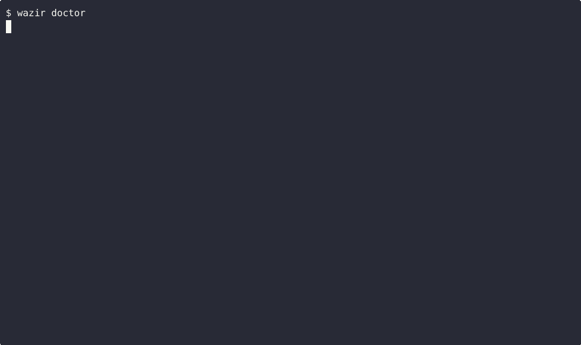

<p align="center">
  <picture>
    <source media="(prefers-color-scheme: dark)" srcset="assets/logo-dark.svg">
    <source media="(prefers-color-scheme: light)" srcset="assets/logo.svg">
    
  </picture>
</p>

<h3 align="center">Your AI agent writes code fast. Wazir makes it write code <em>right</em>.</h3>

<p align="center">
  <a href="https://github.com/MohamedAbdallah-14/Wazir/stargazers"></a>&nbsp;
  <a href="https://www.npmjs.com/package/@wazir-dev/cli"></a>&nbsp;
  <a href="https://github.com/MohamedAbdallah-14/Wazir/blob/main/LICENSE"></a>&nbsp;
  <a href="https://github.com/MohamedAbdallah-14/Wazir/actions/workflows/ci.yml"></a>
</p>

<p align="center">
  
  
  
  
</p>

---

I'm Mohamed Abdallah. I kept watching AI agents write confident code that broke in production, skip tests, and forget what we agreed on yesterday. So I stopped asking them to be better and built them an engineering department instead.

**Wazir is an engineering OS for AI coding agents.** No wrapper. No server. Just structure that loads directly into Claude Code, Codex CLI, Gemini CLI, and Cursor.

<!-- TODO: Record demo GIF with assets/record-demo.sh — show /wazir pipeline from prompt to reviewed output
<p align="center">
  
</p>
-->

---

## Get Started

```bash
/plugin marketplace add MohamedAbdallah-14/Wazir
/plugin install wazir
```

Then tell your agent what to build:

```
/wazir Build a REST API for task management with JWT auth
```

That's it. Wazir takes over -- clarifies your requirements, writes a spec, plans the work, implements with TDD, runs adversarial review, and learns for next time. You approve at the gates. Everything else is automatic.

<details>
<summary>npm / Homebrew / from source</summary>

```bash
npm install -g @wazir-dev/cli                                              # npm
brew tap MohamedAbdallah-14/homebrew-wazir && brew install wazir           # Homebrew
git clone https://github.com/MohamedAbdallah-14/Wazir.git && cd Wazir && npm ci  # source
```

For Codex / Gemini / Cursor: run `wazir export build` and copy the generated package. See [Host Setup](docs/getting-started/04-host-setup.md).

</details>

---

## What It Does

You ask Wazir to build a Flutter RTL app with authentication.

It doesn't just start writing code. The **clarifier** asks what you actually mean -- which auth provider, which RTL edge cases matter, what the error states should look like. The **researcher** checks your codebase for existing patterns. The **specifier** writes a contract that a separate **reviewer** tears apart before a single line is written.

Then the **executor** starts building. But it's not a generalist pretending to know Flutter. Wazir's composition engine loaded Flutter patterns, RTL layout rules, and mobile antipatterns into its context. The reviewer waiting downstream got a completely different set -- what to flag, not how to build. Every dispatched agent is a specialist.

When the executor says "done," it doesn't matter. The **verifier** runs the tests. The **reviewer** -- who never saw the implementation plan, who has different expertise modules -- finds what the executor is structurally blind to. Only when the reviewer explicitly approves does the work advance.

The findings feed a **learning system**. Next run, if the task touches the same files, the pipeline remembers what went wrong and loads those learnings into context. Wazir gets smarter every time it runs.

Four phases. Three approval gates. The agent doesn't get to say "done." The process decides.

```
/wazir quick fix the login redirect bug        # fast-track for small fixes
/wazir deep design a new onboarding flow        # deep mode for complex work
/wazir audit security                           # run a codebase audit
```

---

## Why Wazir?

**The reviewer is never the author.** When your AI agent reviews its own code, it finds what it expected to find -- nothing. Wazir's adversarial reviewer is a separate agent with different expertise modules. It catches the mistakes your agent is structurally blind to.

**Every agent is a specialist, not a generalist pretending.** A composition engine built on hundreds of curated expertise modules across 12 domains picks which knowledge loads per role per task. The executor and reviewer never see the same context. No other tool does this.

**The pipeline enforces discipline.** Four phases with three approval gates that can't be skipped. Rejection loops back to the authoring phase. Three-layer enforcement prevents the agent from rationalizing shortcuts.

**It learns from its own mistakes.** Review findings become scoped learnings, tagged with file patterns, stored across runs. The pipeline improves per-project without drifting.

**It saves tokens.** Tiered recall (L0/L1/direct read) + capture routing. Each role gets the minimum context it needs. 60-80% token reduction on exploration-heavy phases, measured per-session by `wazir capture usage`.

**It runs everywhere you do.** One source of truth compiles to native packages for Claude Code, Codex CLI, Gemini CLI, and Cursor. SHA-256 drift detection in CI.

---

## Compared to Other Tools

Not every project needs this much structure. For a weekend hack, prompting is fine. For production, you want enforcement.

| | [Wazir](https://github.com/MohamedAbdallah-14/Wazir) | [Superpowers](https://github.com/obra/superpowers) | [Spec-Kit](https://github.com/github/spec-kit) | [OMC](https://github.com/yeachan-heo/oh-my-claudecode) |
|---|---|---|---|---|
| **What it is** | Engineering OS | Skills framework | Spec toolkit | Orchestration layer |
| **Approach** | Enforced roles + phases | Advisory workflow | Specify → plan → implement | Multi-agent orchestration |
| **Domain expertise** | Composition engine, per-role | None | None | None |
| **Review** | Adversarial gates (separate agent) | Code review skill | No | team-verify step |
| **Learning** | Scoped, cross-run | None | None | None |
| **Hosts** | Claude, Codex, Gemini, Cursor | Claude, Codex, Gemini, Cursor, OpenCode | Claude, Copilot, Gemini | Claude Code |

Each of these tools solves a real problem. Wazir's approach is to solve them together -- one system, shared context, structural enforcement.

---

## Documentation

| I want to... | Go to |
|---|---|
| Install and get started | [Installation](docs/getting-started/01-installation.md) |
| Run my first task | [First Run](docs/getting-started/02-first-run.md) |
| Understand the architecture | [Architecture](docs/concepts/architecture.md) |
| Learn about roles and workflows | [Roles & Workflows](docs/concepts/roles-and-workflows.md) |
| Write expertise modules | [Module Authoring](docs/guides/expertise-module-authoring.md) |
| Look up CLI commands | [CLI Reference](docs/reference/tooling-cli.md) |
| Browse all docs | [Documentation Hub](docs/README.md) |

---

## Project Status

Wazir is in active early development (pre-1.0-alpha). The pipeline, roles, and expertise modules are stable and used in production by the maintainers. The CLI surface may change before 1.0.

Feedback and contributions are welcome. See [CONTRIBUTING.md](CONTRIBUTING.md).

---

## Why "Wazir"?

Wazir (وزير) -- the vizier. The operational mastermind who ran empires while the sultan held authority. In Arabic chess, the wazir became the queen: the most powerful piece on the board.

The Arabic word *itqan* (إتقان) means mastery -- doing something so well that nothing remains to improve. This isn't a tagline. It's the test every commit runs against.

---

## Acknowledgments

Wazir builds on ideas and patterns from these projects:

- **[superpowers](https://github.com/obra/superpowers)** by [@obra](https://github.com/obra) -- skill system architecture, bootstrap injection, session-start hooks
- **[context-mode](https://github.com/mksglu/context-mode)** -- context window optimization and sandbox execution
- **[spec-kit](https://github.com/github/spec-kit)** by GitHub -- specification-driven development patterns
- **[oh-my-claudecode](https://github.com/yeachan-heo/oh-my-claudecode)** by [@yeachan-heo](https://github.com/yeachan-heo) -- Claude Code extension patterns
- **[micro-agent](https://github.com/BuilderIO/micro-agent)** by Builder.io -- test-driven code generation
- **[distill](https://github.com/samuelfaj/distill)** by [@samuelfaj](https://github.com/samuelfaj) -- CLI output compression
- **[claude-mem](https://github.com/thedotmack/claude-mem)** by [@thedotmack](https://github.com/thedotmack) -- persistent memory patterns
- **[ideation](https://github.com/bladnman/ideation_team_skill)** by [@bladnman](https://github.com/bladnman) -- multi-agent structured dialogue

---

## License

MIT -- see [LICENSE](LICENSE).
